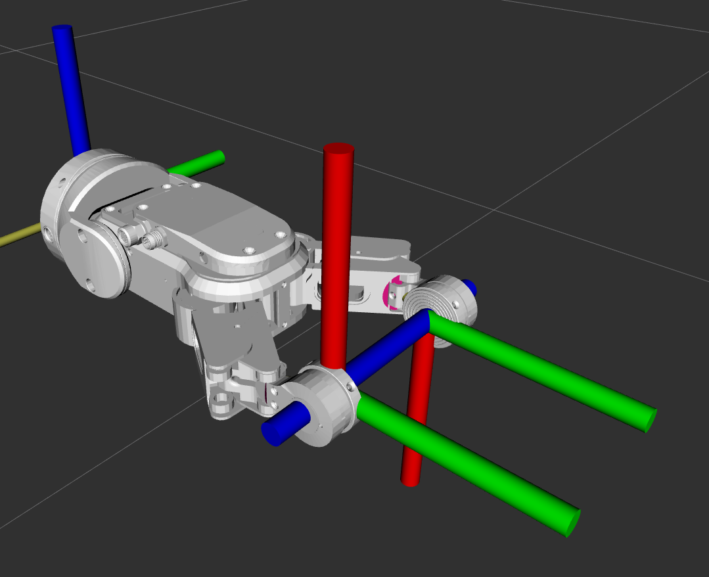

rg2_ft_ros
============

This repository contains ROS packages needed for using the OnRobot RG2-F/T gripper.




NOTE: This repository is not being actively maintained.  Bug-reports and pull-requests are welcome, but there are some
notable gaps in the packages' capabilities which are not planned to be addressed in the foreseeable future.


Physical Installation
-----------------------

The gripper must be connected to the OnRobot Compute Box, which in turn must be connected to the computer
using a normal ethernet cable.  The gripper must be powered following the manufacturer's instructions.


rg2_description
--------------------

This package contains the URDF and supporting files for representing the gripper on a robot.

This package contains meshes for the RG2 gripper authored by Sharath Jotawar as part of the now-archived
ur10_rg2_ros package, available here: https://github.com/sharathrjtr/ur10_rg2_ros

The main body of the hand extends along the X-axis.  The Left and Right fingers match the labels on the physical
gripper, and the coordinate frames of the fingertips are rotated to match these same labels.

For simplicity the hand's joints are not fully modelled; on the real gripper the first finger links are compound
joints that have expanding segments physically keep the fingertips in alignment.  This package treats all 4 finger
joints as independent revolute joints.  The driver is responsible for pubishing the underlying joint angles.

Note that the physical hand supports setting independent default angles for each fingertip.  At present this is not
supported; the URDF and driver both assume that the fingertip angles are set to 0 and that the fingers always move
in a synchronized fashion.


rg2_driver
--------------

This package contains the underlying ROS driver for the gripper.  The driver requires PyModbus.

To open/close the gripper, publish to the ``gripper/cmd/move`` topic:

```bash
rostopic pub /gripper/cmd/move rg2_msgs/GripperCommand "force_n: 40.0
width_mm: 85.0
stop: false" -1
```

When moving the gripper the force must be set high enough to overcome the inertia of the fingers.  Generally 10N or more
is sufficient.  The width can be specified anywhere from 0mm to 100mm.  If the ``stop`` parameter is true, the gripper
will immediately stop moving, regardless of the goal with and force.

The FT sensors in the fingertips can be zeroed/un-zeroed by publishing to the ``gripper/cmd/zero`` topic:

```bash
rostopic pub /gripper/cmd/zero std_msgs/Bool "data: true" -1
```

The ``gripper/is_zero`` topic publishes whether or not the sensors are currently zeroed.

The gripper's actual width, as determined by the hardware encoder, is published to the ``gripper/width`` topic.

The modbus TCP protocol the gripper implements prevents it from receiving new commands until the previous one finishes.
The ``gripper/moving`` topic publishes ``true``while the gripper is moving, indicating it cannot receive new commands.

Finally, the FT sensor data from each fingertip is published as a sensor_msgs/WrenchStamped message on the
``gripper/left_fingertip`` and ``gripper/right_fingertip`` topics.  The coordinate frames of these topics are aligned
to match the XYZ labels on the physical gripper (+Y is away from the wrist, +Z is along the open direction).

The modbus TCP protocol has a theoretical upper bound of 125Hz.  The driver in its default state queries the position
and sensor data from the gripper at a rate of 50Hz. This can be modified by editing the ``rate`` argument of
``rg2_ft.launch``


rg2_msgs
--------------

This package contains additional ROS messages used by the gripper driver.


Future Work & Limitation
---------------------------

Currently this driver works with the RG2-F/T gripper.  It has not been tested with any other grippers.  Limited support
for the RG2 may be available via the `ur10_rg2_ros` package referenced earlier.

If you have another OnRobot gripper and would like to either fork this repository to expand the supported devices, or
submit a PR please feel free to do so.

The simulation parameters of the gripper have not been exhaustively tested.  The intent of the URDF macro is primarily
to provide visual feedback of a physical robot's state in Rviz, and not to provide accurate simulation inside Gazebo.
